# Проект тестирования Toshl – мобильного и веб приложения для учета личных финансов

[Toshl personal finance](https://toshl.com/personal-finance/)

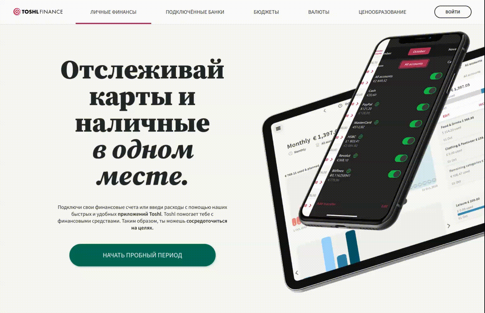

## Содержание:

> [Список проверок](#автотестами-проверяется)
> [Запуск на Jenkins](#запуск-на-jenkins)
> [Локальный запуск](#локальный-запуск)
> [Allure отчет](#allure-отчёт)
> [Видео прохождения тестов](#видео-прохождения-тестов)
> [Уведомления о прохождении в Telegram bot](#telegram-бот)
> [Интеграция с Allure TestOps](#интеграция-с-allure-testops)
> [Интеграция с Jira](#интеграция-с-jira)

## Автотестами проверяется

### Web/UI

* [X]  Добавление расхода
* [X]  Редактирование суммы и категории
* [X]  Удаление и добавление тега
* [X]  Дублирование расхода
* [X]  Удаление расхода
* [X]  Авторизация через логин и пароль

### API

* [X]  Добавление расхода
* [X]  Удаление расхода
* [X]  Получение списка транзакций
* [X]  Ошибка при удалении несуществующего расхода

### Mobile

* [X]  Добавление расхода
* [X]  Авторизация через логин и пароль
* [X]  Ошибка авторизации с неверным паролем

## Технологии

 

## Запуск на Jenkins

#### Параметры сборки

* `environment` - окружение для запуска тестов, будет указано в нотификации в Telegram
* `comment` - комментарий к запуску, будет указан в нотификации в Telegram

#### Чтобы запустить автотесты в Jenkins

1. Открыть [проект](https://jenkins.autotests.cloud/job/julia_shilkova-toshl_tests_demo/)
2. Выбрать пункт `Build with Parameters`
3. Выбрать окружение в выпадающем списке
4. Добавить комментарий
5. Нажать кнопку `Build`
6. Результат запуска сборки можно посмотреть в отчёте Allure

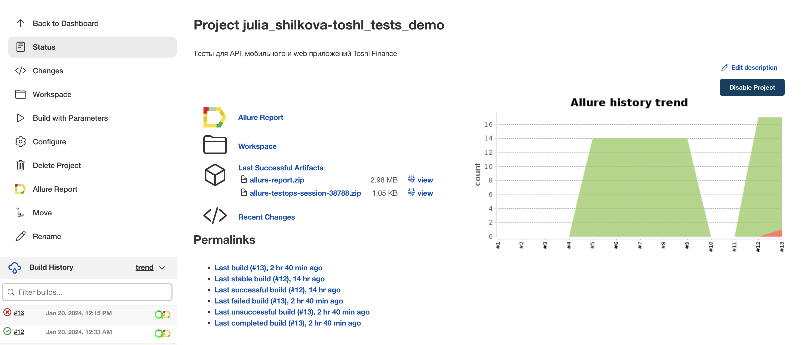

## Локальный запуск

### Параметры запуска

`--context`  принимает значения `local` и `cloud`

* `local` запустит web/UI тесты локально в браузере Chrome, мобильные тесты - на локальном эмуляторе
* `cloud` запустит web/UI тесты на Selenoid, мобильные тесты - на Browserstack. **Используется по умолчанию.**

### Переменные среды

| Переменная              | Required | cloud | local | Описание                                                    |
|-------------------------|:--------:|:-----:|:-----:|-------------------------------------------------------------|
| `SELENOID_LOGIN`        |    ✓     |   ✓   |       | логин для акаунта Selenoid                                  |
| `SELENOID_PASSWORD`     |    ✓     |   ✓   |       | пароль для акаунта Selenoid                                 |
| `SELENOID_REMOTE_URL`   |          |   ✓   |       | Selenoid remote url                                         |
| `TIMEOUT`               |          |   ✓   |   ✓   | таймаут драйвера                                            |
| `REMOTE_URL`            |    ✓     |   ✓   |   ✓   | url локального appium сервера или browserstack              |
| `APP_WAIT_ACTIVITY`     |          |   ✓   |   ✓   | имя активити приложения                                     |
| `APP`                   |    ✓     |   ✓   |   ✓   | apk приложения или идентификатор приложения на Browserstack |
| `UDID`                  |    ✓     |       |   ✓   | udid эмулятора для запуска                                  |
| `PLATFORM_NAME`         |          |   ✓   |       | имя мобильной платформы для запуска                         |
| `PLATFORM_VERSION`      |          |   ✓   |       | версия Android                                              |
| `DEVICE_NAME`           |          |   ✓   |       | название устройства                                         |
| `OPTIONS__PROJECT_NAME` |          |   ✓   |       | имя проекта                                                 |
| `OPTIONS__BUILD_NAME`   |          |   ✓   |       | билд                                                        |
| `OPTIONS__SESSION_NAME` |          |   ✓   |       | имя сессии                                                  |
| `OPTIONS__BS_USERNAME`  |    ✓     |   ✓   |       | имя пользователя на Browserstack                            |
| `OPTIONS__BS_PASSWORD`  |    ✓     |   ✓   |       | пароль на Browserstack                                      |

Для локального запуска тестов нужно:

1. Cклонировать себе репозиторий
2. Для запуска мобильных тестов локально установить Appium 2.0.1+ и запустить Appium server
3. Установить зависимости `poetry install`
4. Задать нужные переменные среды
5. Выполнить в терминале команду для запуска тестов
   * всех `python -m pytest .`
   * web/ui  `python -m pytest tests/web`
   * API `python -m pytest tests/api`
   * мобильных `python -m pytest tests/mobile`

## Allure отчёт

#### Общие результаты

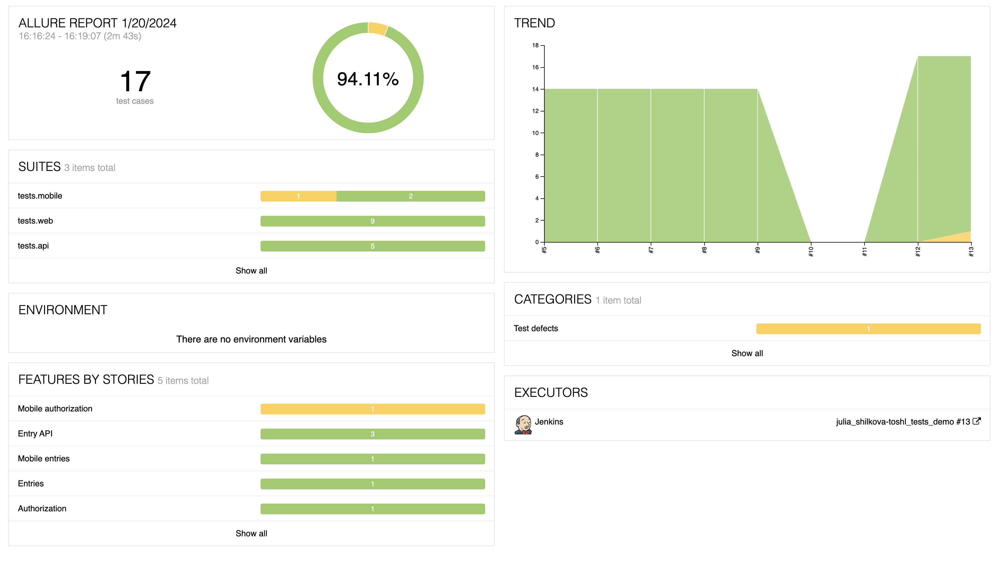

#### Подробный отчет о прохождении теста

Для каждого теста помимо шагов добавлены скриншот, код страницы, видео прохождения и логи браузера,
чтобы легче находить причину, по которой упал тест.

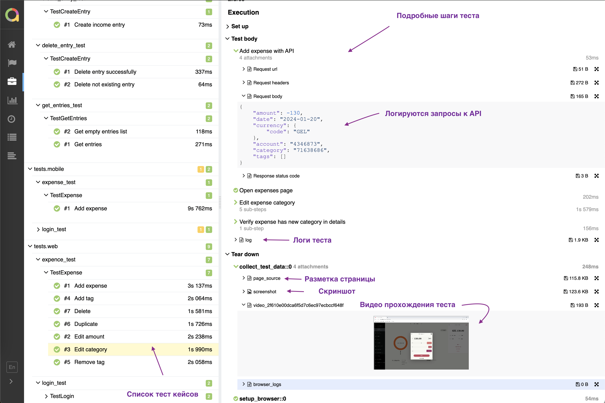

## Видео прохождения тестов

#### Web/UI тесты

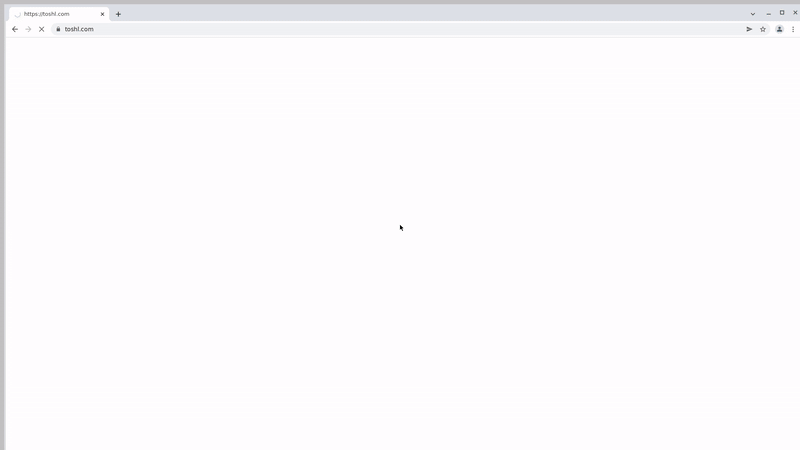

#### Mobile тесты

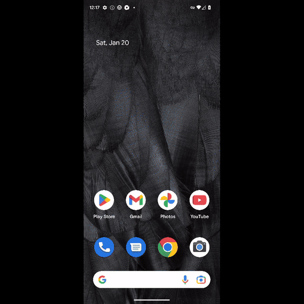

## Telegram бот

Результаты прохождения тестов приходят в чат в Telegram: так ответственные могут быстро узнавать о проблемах.
В кратком отчете есть процент упавших тестов и ссылка на страницу с подробным allure отчетом.

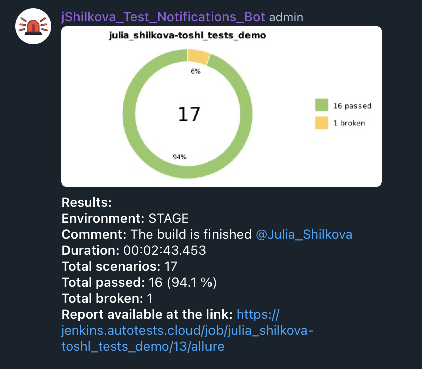

## Интеграция с Allure TestOps

##### Дашборд с общими показателями тестовых прогонов

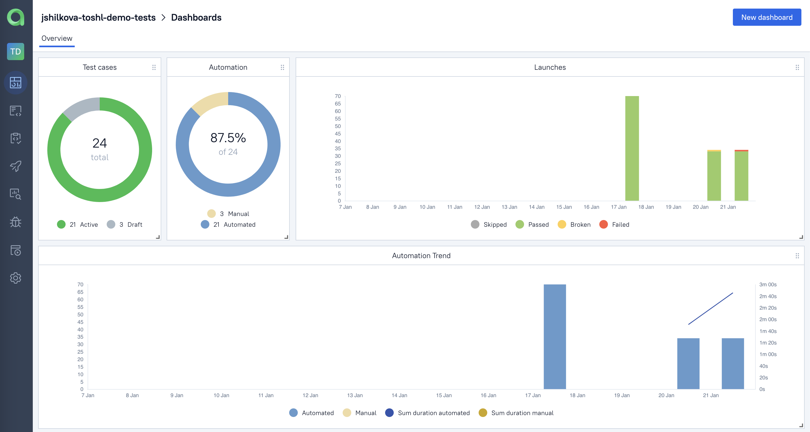

##### Тест кейсы

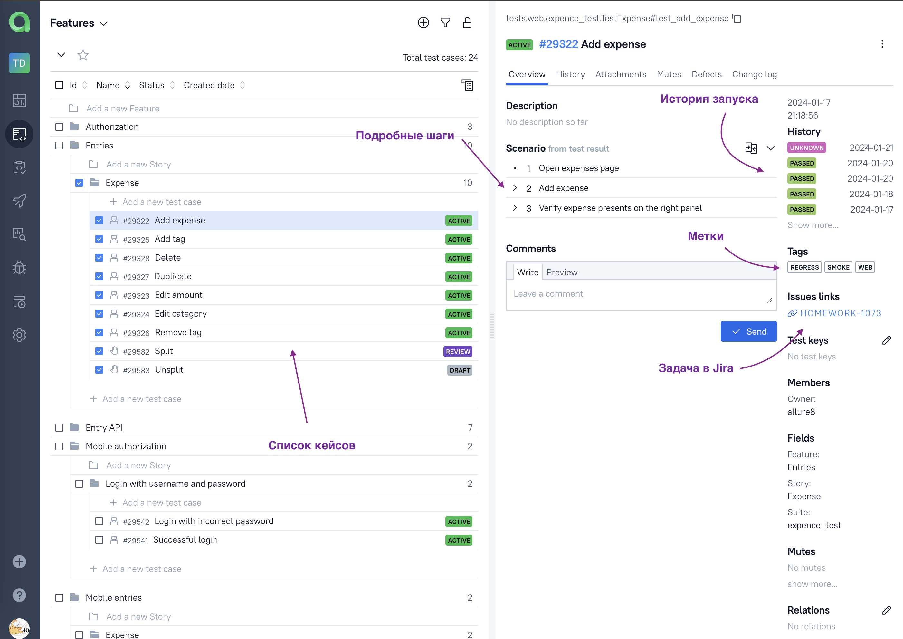

##### TestOps интегрирован с Jenkins. Можно запустить тесты из списка

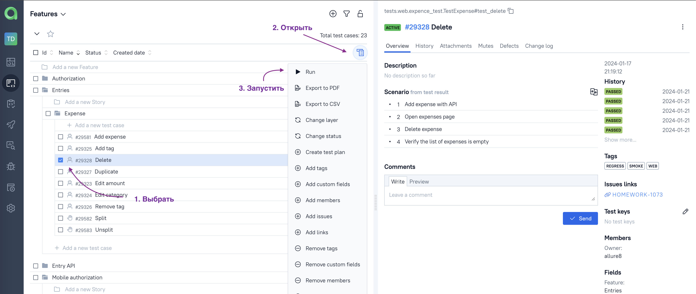

##### Доступна история запусков

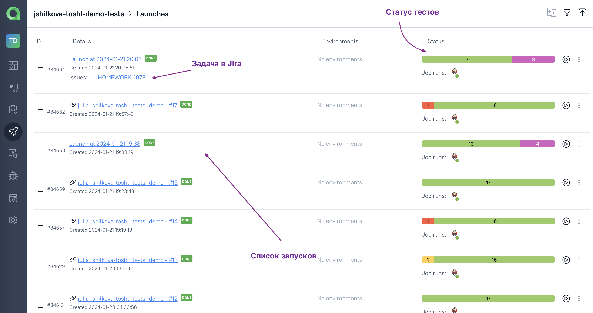

#### Подробный отчет о запуске теста с артефактами

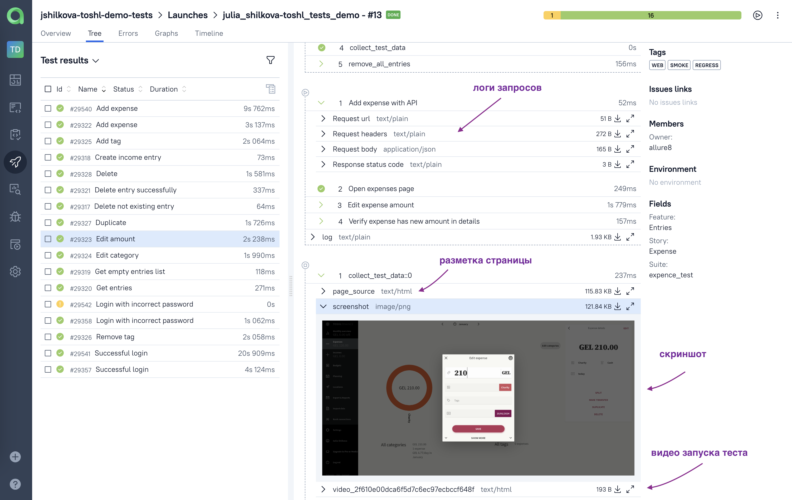

## Интеграция с Jira

TestOps интегрирован с Jira. 
Можно прямо в задаче посмотреть список тест кейсов и запусков

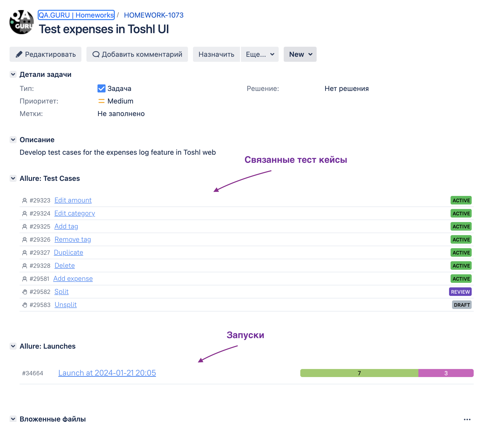
